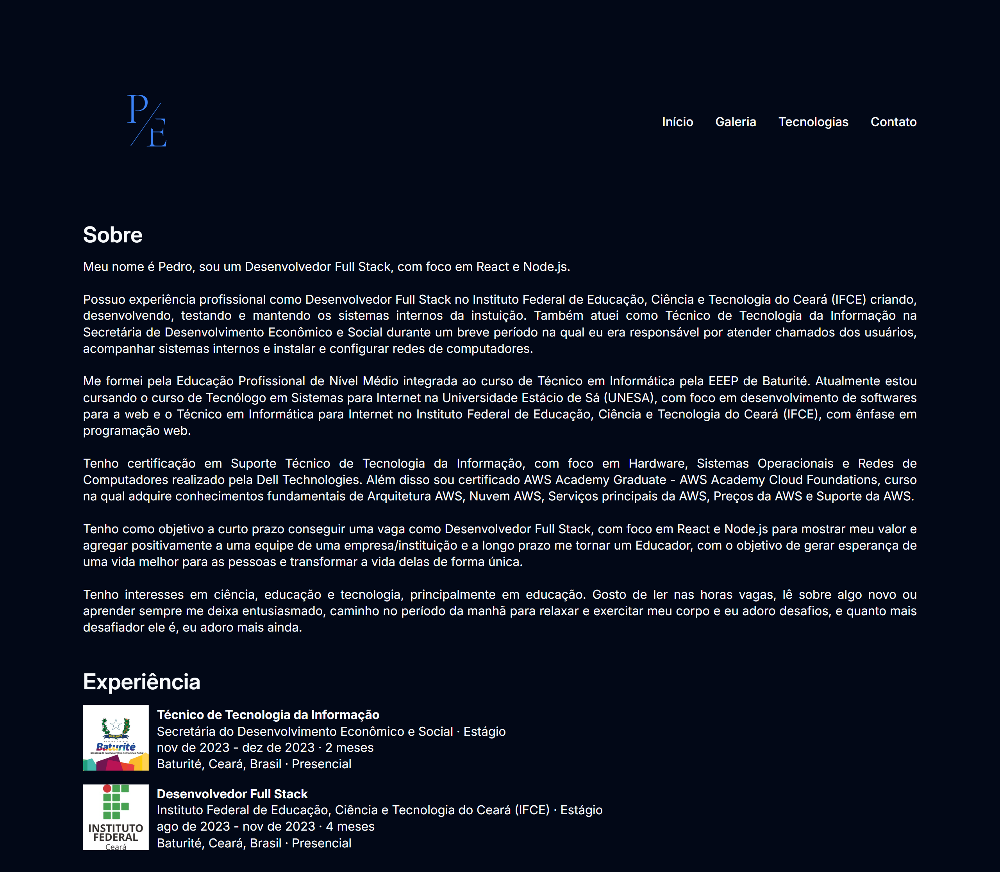

<h1 align="center">
  Portfólio
</h1>

<ul>
  <li>
    <a href="#sobre-o-projeto">
      Sobre o projeto
    </a>
  </li>
  <li>
    <a href="#tecnologias">
      Tecnologias
    </a>
  </li>
  <li>
    <a href="#pre-requisitos">
      Pré-requisitos
    </a>
  </li>
  <li>
    <a href="#como-instalar-o-projeto">
      Como instalar o projeto
    </a>
  </li>
  <li>
    <a href="#como-executar-o-projeto">
      Como executar o projeto
    </a>
  </li>
  <li>
    <a href="#demonstração-da-aplicação">
      Demonstração da aplicação
    </a>
  </li>
  <li>
    <a href="#autor">
      Autor
    </a>
  </li>
  <li>
    <a href="#licença">
      Licença
    </a>
  </li>
</ul>

<p align="center">
  
</p>

## Sobre o projeto

O Projeto do Módulo Básico do Curso de Extensão em Desenvolvimento Full Stack do Capacita Brasil tinha como objetivo desenvolver um Portfólio com HTML e CSS.

## Tecnologias

O projeto foi desenvolvido com as seguintes tecnologias:

- [HTML](https://developer.mozilla.org/pt-BR/docs/Web/HTML)
- [CSS](https://developer.mozilla.org/pt-BR/docs/Web/CSS)

## Pré-requisitos

Verifique aos seguintes pré-requisitos para poder instalar e executar o projeto:

1. Ter instalado um editor de código:
   - [VS Code](https://code.visualstudio.com/download)
   - [Sublime Text](https://www.sublimetext.com/download)
   - [Notepad++](https://notepad-plus-plus.org/downloads)
2. Ter instalado o [Git](https://git-scm.com/downloads)
3. Ter instalado a extensão [Live Server](https://marketplace.visualstudio.com/items?itemName=ritwickdey.LiveServer)

## Como instalar o projeto

Siga o passo a passo para instalar o projeto:

1. Abra o terminal e clone o repositório do projeto:

```bash
git clone https://github.com/pedroeuzebiojs/portfolio-mod-bas-curso-extensao-dfs-cap-bra-uece
```

## Como executar o projeto

Siga o passo a passo para executar o projeto:

1. Entre na pasta do projeto clonado:

```bash
cd portfolio-mod-bas-curso-extensao-dfs-cap-bra-uece
```

2. Abra a pasta do projeto clonado no editor de código de sua preferência. Caso seja o VS Code digite o comando:

```bash
code .
```

3. Abra o arquivo `index.html` com a extensão Live Server do VS Code

## Demonstração da aplicação

- [Exibir projeto](https://pedroeuzebiojs.github.io/portfolio-mod-bas-curso-extensao-dfs-cap-bra-uece)

## Autor

<table>
  <tr>
    <td align="center">
      <a href="https://github.com/pedroeuzebiojs">
        
      </a>
      <br />
      Pedro Euzebio
    </td>
  </tr>
</table>

## Licença

O projeto está sob licença MIT. Veja o arquivo [LICENSE](./LICENSE) para mais detalhes.
